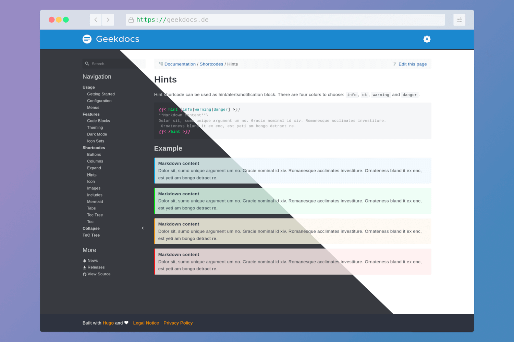

# Teamsites - documentation hosting

Teamsites is an easy way to host, protect and share your site.

Teamsites turns Hugo, MkDocs, Gatsby, and other static site generators into superior Confluence alternative.

## What can you make with Teamsites?

You can use a variety of [static site generators](https://jamstack.org/generators/) and themes.
You can start without knowing Git or programming language.
I will help you choose the best starting tool.




## Share your ideas with a publicly available personal blog

- Choose a domain name and upload site files in a few clicks;
- Don't worry about Git and hosting. Focus on content;
- I will help you to start and move to free GitHub Pages and Netlify.




## Keep your documentation secure

Create a documentation site only for your teammates:

1. Generate documentation website from Markdown files;
2. Host it privately;
3. Invite your teammates;
4. Enjoy better reader and editor UX than Confluence can provide;
5. View pageview stats.




## Secure share news feed

Create a private blog for a company or closed community:

1. Generate a website from Markdown files;
2. Host it privately and share the invite link;
3. View pageview stats.




## Share dev builds and tools

You can upload site files manually or using CI:

1. Dev builds;
2. storybook.js interactive docs;
3. Share review link to a customer;
4. View download statistics.




## Features

Key abilities for teams and individual creators.



- Choose the files folder. You don't need a GitHub account;
- Start small. Our tutorials will help you to set up a generator, theme and website analytics;
- Let's create your site.
  
  
- Make your sites private without a line of code;
- Create a team and add teammates and sites;
- Simple team management: invite links, access expiration, role changing, team transfer.

[//]: # (TODO login screenshot)

[//]: # (TODO entity diagram: team, teammate, site, role, access &#40;&#41;)

[//]: # (TODO teams screenshot)



[//]: # (TODO graph screenshot)

- Be sure that your pages were visited;
- See site upload and views from your teammates.
  
  
- Allow external people to see your private site;
- Share your private site by time-limited link;
- See link usage statistics.

[//]: # (TODO create link screenshot)



- No vendor lock and warranties. You own your pages;
- Use open-source tools to host your knowledge base.



## Why is it useful?

I wrote a few articles about the good sides of the usage static site generators and diagram as code tools.

Popular documentation tools like Confluence and Notion are too complicated.
They have a lot of features, but everybody is missing something or paying for unused.

On the other side, static sites are simple, fast, powerful and customizable.
And you will have the best offline text editing experience using IDE.

A lot of developers use tools like MkDocs for public and private documentation.
But static site generators are not only for programmers.

Anyone can easily create content in Markdown files and generate beautiful and functional websites for free.

So I started to build a platform that:

- Allows starting using static sites;
- Provides few features that are hard to create with static sites only (statistics and access control);
- Provides simple tools to automate many things to keep your documentation updated and in sync with the product.

## If you are interested

Let's talk then. Join [this telegram group](https://t.me/+ZxMYEaHJU_kyZGZi) and get an early access.
