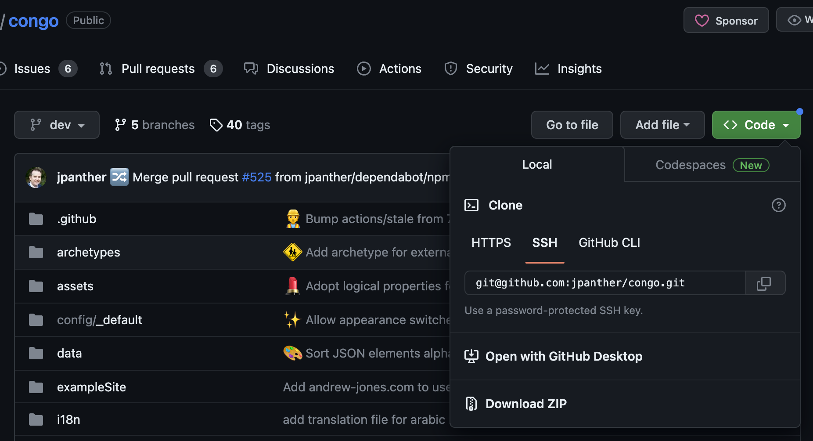

This article is set of answers to most popular questions
of beginner Hugo static sites generator users.

Also, it contains a tutorial on how to create site with De Hugo.
Desktop Hugo is user interface application with for people
who are not from programming and have no Git and CLI usage skills.
It can be run on Windows, macOS or Linux.

## De Hugo Goal

D'Hugo is free open source desktop application for websites creation.
It's written in [Go](https://go.dev/) on top of [Hugo](https://gohugo.io/) source code
and using [fyne](https://fyne.io/) UI.





Purpose of desktop Hugo application is simple visual interface
for people that not familiar with CLI.

### Easy start

It allows easy start and usage for people not familiar with command line applications.

Many people commit changes in Git using SourceTree and doing requests using Postman.
I used it when started my carrier as android developer.

CLI unfamiliar for many people.
But it must not be obstacle for them to use such great tool as Hugo.

### Productivity

It improves productivity though visualisation

I am a backend engineer and can manage linux servers though ssh connections.
I think, Git and curl is simple and easy to learn command line applications.
But in everyday work I prefer visual UI for git and http requests inside my GoLand IDE.
Because it gives better changes visualisation and simple work automation.

## Choosing website theme

Themes is a set of templates that used to generate website files.
It is key to easy and fast website creation.

But if you are new to Hugo, I recommend you to start from this themes.
Focus on your content.
You can easily change theme in future almost without changes in md files.




## Congo

I recommend to start blogging with Congo theme.

It has a lot of useful shortcodes.
Especially for science and software design content.

Read [my blog post about this theme]().



## Geekdoc

You can build tutorials, documentation or course.

> If you want to create internal team documentation or sell content online.
>
> You can hide your website behind password. That's not secure enough, but enough for start.

Read [my blog post about this theme]().




## It is hard.

There is [a lot of themes](https://themes.gohugo.io/).
But you can do anything without HTML, JS, CSS skills and SEO experience.

### Landing Page

With existing themes you can create only simple pages.
All themes that I checked in Landing category requires you to editing theme HTML layout.

So it's better to use no code constructors now.

### E-commerce

E-commerce is hard, because you need payment provider and json integration with its product list.

You should hire someone to set up environment.
Even existed no code tools is hard to learn for selling online products.



## Using app

Here is instructions on how to create blog using Congo theme.


You can change theme.

Content files folders structure and page parameters depends on theme.
You should follow theme documentation or see example site files.


### Preconditions

#### Install Desktop Hugo app

blabla

#### Install text editor

You need some text editor app with Markdown support.

If you are new to text editing outside of Word or GDocs.
Consider to use [VSCode](https://code.visualstudio.com/).
It has build in Markdown and Git support.
Do not fear `Code editing` title. Besides, it's just a text editor. 

### Download and chose project

#### Download congo theme starter files archive

TODO create starter repository
   - congo and geekdoc themes. congo default. instruction on how to change to geekdoc

Unzip it. This will be your project files.

Rename and move project folder at will.

#### Open app and select your project folder

You can't do anything while there is no selected project.

Your selection will be saved. You don't need to choose on every application run.

### Preview

Now you can start local website server to preview site.

Just click `Run` button. Site will be updated on every change in project files.

### Creating content

1. Open your project in text editor
2. 

### Build

### Errors

1. Look at error message and logs widget to figure out problem.
2. Try to google problem.
3. Have trouble?
    1. Contact me by email (1 week response time, so give me more question context, to save your time)
    2. Join donation group to quick support and learning. Get help with deployment.

## Deployment

I advise you to choose any service that your friends uses.

I will give you 2 recommendations.

### Easiest one

If you are new to site building. I recommend you to start from this option.

[tiiny.host](tiiny.host) allows you to drag and drop your site to internet for free.

1. Compress `public` folder to `.zip` archive;
2. Upload it;
3. Done. It's online.

You can set domain name and visitors statics collection.

### Powerful and popular

If you are ready to spend few days more onto learning, you can use more powerful tool.

For example [Cloudflare Pages](https://pages.cloudflare.com/)

Just upload files. But here you'll get analytics for free.
But custom domain and https setting require money.

## Why

Here is why X section

### Why [Hugo](https://gohugo.io/)


GoLang allows to compile app into single small executable file.
User must not install go, python, node, etc.



Hugo can handle thousands pages in second.



Hugo templates can be used for many website types.

For example, [mdBook](https://github.com/rust-lang/mdBook) written in [Rust](https://www.rust-lang.org/).
It's fast and compilable, but can be used only for documentation.


### Why [Fyne](https://fyne.io/)

TODO

