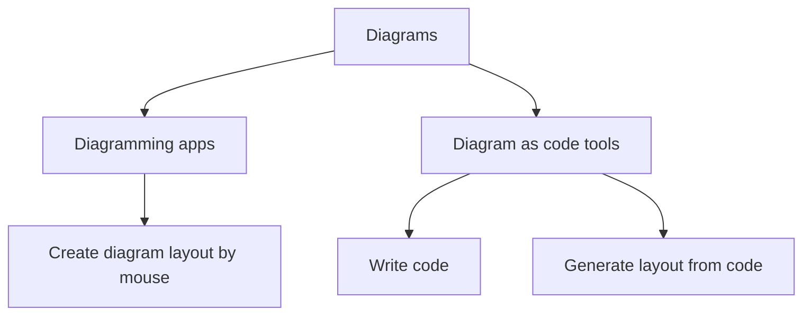
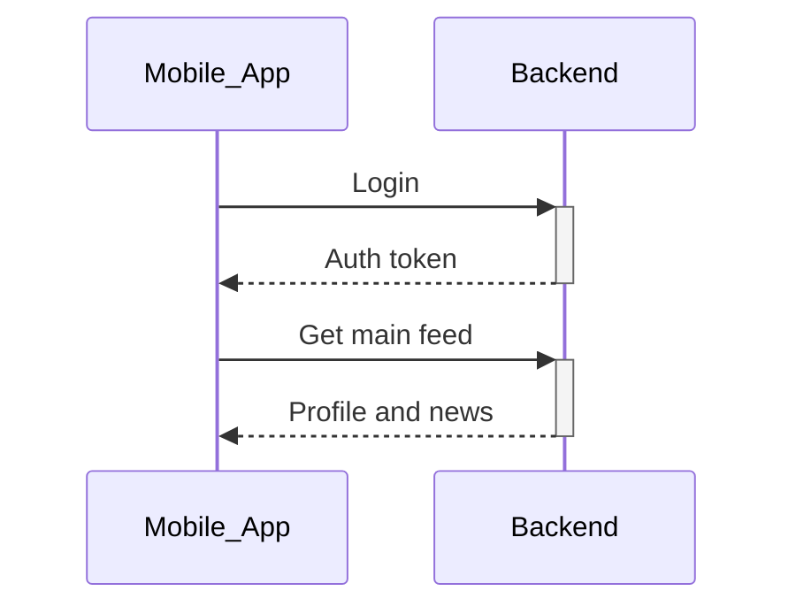
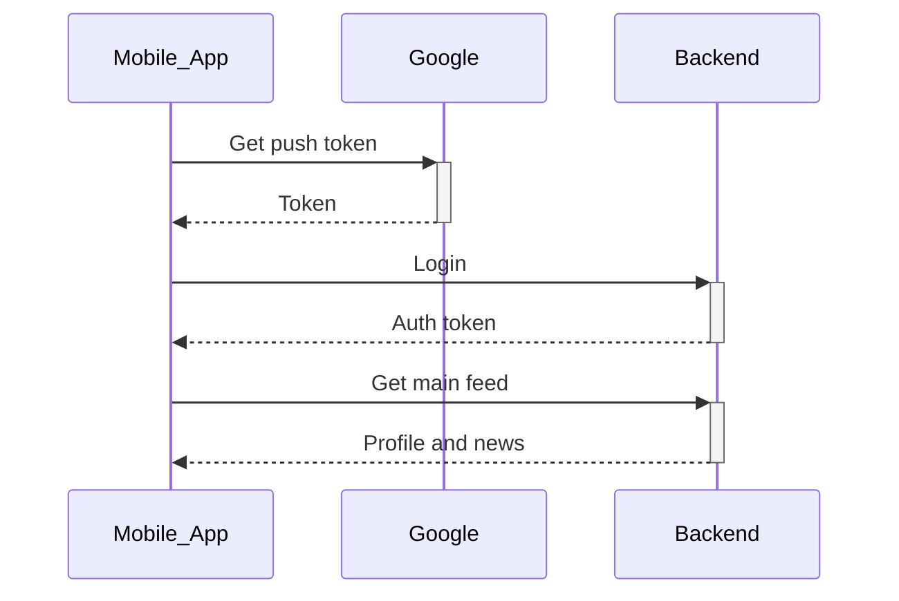
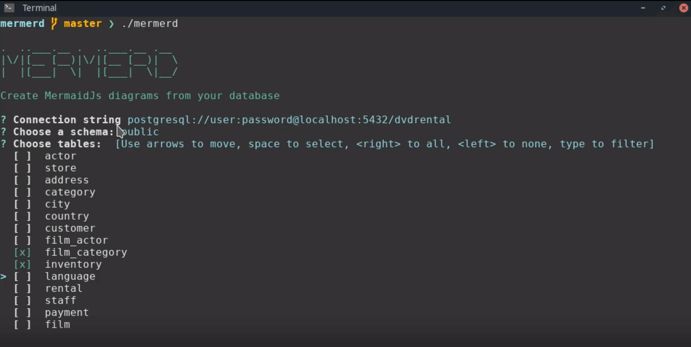
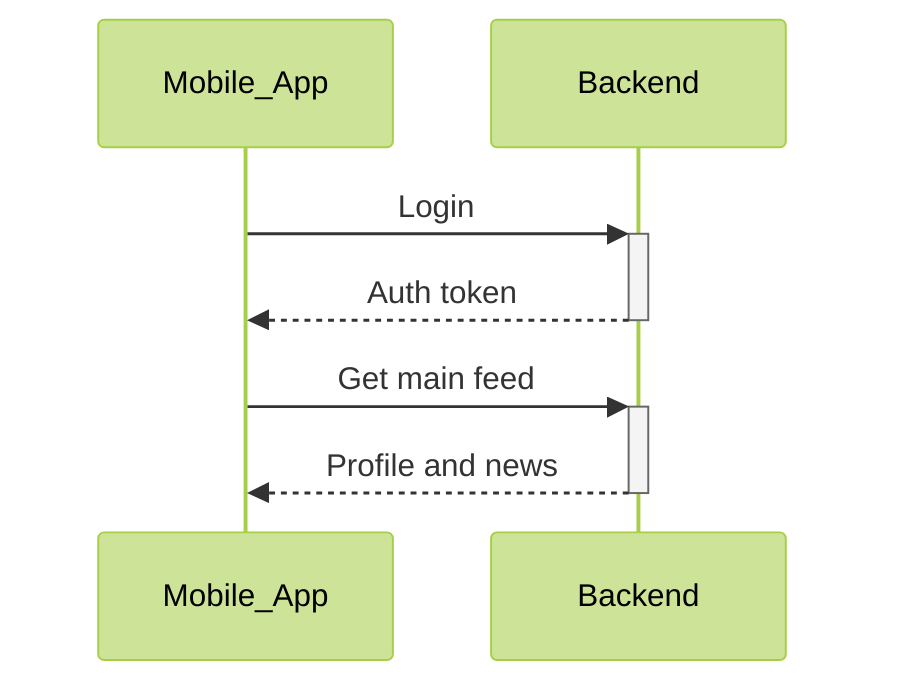
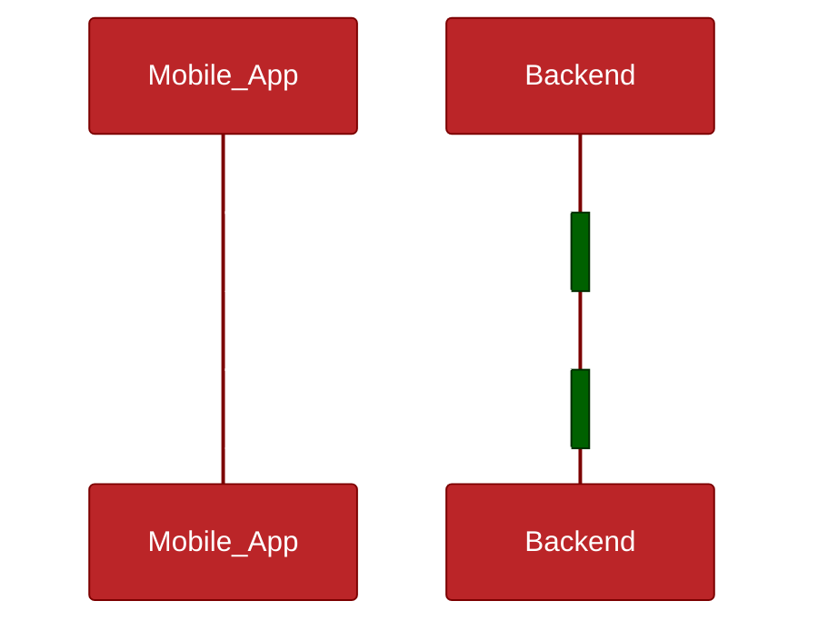

## Diagrams

Diagrams are a powerful tool for visualizing complex systems and processes.
They can help understand important information quickly and clearly.

However, creating diagrams can be time-consuming and tedious. 
You need to spend hours in diagramming app like Lucidchart or diagrams.net.

This is where diagrams as code come in.

## Diagrams as code

Diagrams as code, as the name suggests, involve writing code to generate diagram images or HTML automatically.
The most popular and mature tools for that are PlantUML and Mermaid.

### Example

Let's create a simple visualization with the [Mermaid.js](https://mermaid.js.org/) tool.

Here is our code:
```
flowchart TD
    A[Diagrams]
    A --> B[Diagramming apps]
    B --> AB[Create diagram layout by mouse]
    A --> C[Diagram as code tools]
    C --> AC[Write code]
    C --> ABC[Generate layout from code]
```

And this is our visualization. 


## Benefits

Diagrams as code have several benefits over traditional diagramming apps, including:

### Time saving

A most important benefit of diagrams as code is that they can save time when editing existing diagrams. 

Since diagrams are defined as code, 
changes can be made quickly and easily 
without the need to manually adjust the layout or formatting.

#### Example




```
sequenceDiagram

    Mobile_App->>+Backend: Login
    Backend-->>-Mobile_App: Auth token
    
    Mobile_App->>+Backend: Get main feed
    Backend-->>-Mobile_App: Profile and news
```


#### Add new actor

All changes can be achieved with just a few lines of code.




```
sequenceDiagram
    Mobile_App->>+Google: Get push token
    Google-->>-Mobile_App: Token
    
    Mobile_App->>+Backend: Login
    Backend-->>-Mobile_App: Auth token
    
    Mobile_App->>+Backend: Get main feed
    Backend-->>-Mobile_App: Profile and news
```


### Automation

The structure of diagram code is simple, 
which allows for the automation of the diagram creation process.

There is a variety of tools for generating diagrams from database structures, 
OpenAPI specifications, and code.



ER tool examples:
- [mermerd](https://github.com/KarnerTh/mermerd) - creates mermaid entity relation diagrams from database schema
- [schemacrawler](https://www.schemacrawler.com/) - tool for easy writing scripts on top of database schema data

System tool examples:
- [inframap](https://github.com/cycloidio/inframap) - get terraform visualization

### Version control

You can get all the benefits of using Git, such as:
- Storing diagram data in GitHub-like services with all changes history
- Tracking, reviewing, and merging changes with conflict resolution.


Existing continuous integration tools can be used to analyze, check proper code style,
enrich, and generate documentation pages.

### Customization

Diagram as code tools have many existing themes and settings that can be used for style customization.





### Open source

Diagram as code tools are open-source and free to use.
You own your data.

## Downsides

There are some things that may not be intuitive.

### No UI

There is no component choosing menu or forms with all parameters.
Therefore, you need to know what you are looking for 
and find it in the documentation and examples.

### Frustrating layout correction

Rare problem.
The automatically generated layout may not satisfy you in complex schemas. 
If that happens, you need to use LAYOUT commands to correct the generator.

## Learning

### Mermaid

Beautiful and popular tool for popular diagrams. JavaScript baset. 

- [Easy docs](https://mermaid.js.org/intro/)
- [Playground](https://mermaid.live/) - you can share diagrams by link and save drafts in browser storage

### PlantUML

PlantUML may be considered an old-school tool, 
but it is still irreplaceable for some diagrams, 
such as [C4 architecture](https://c4model.com/).

- [Old fation docs](https://plantuml.com/)
- [Playground](https://www.plantuml.com/plantuml/uml/)

### Kroki

[Kroki](https://kroki.io/) is a multi-language tool. You can explore all diagram types.

## Usage

- Find and install a [Confluence plugin](https://marketplace.atlassian.com/apps/1226567/mermaid-diagrams-for-confluence?tab=overview&hosting=cloud) for Mermaid or PlantUML diagrams;
- Use a static site generator theme with mermaid included ([Blog](https://jpanther.github.io/congo/)/[Docs](https://geekdocs.de/));
- There is a 99% chance of finding a plugin or out-of-the-box feature in your documentation tool.

[//]: # (TODO ссылки на статьи про конго и докку)

## Conclusion

With a little learning time, you can efficiently:
- Reuse existing diagrams to bootstrap new ones;
- Visualize new features on existing diagrams;
- Get diagrams automatically from code or system configuration.

As a professional software developer, 
I prefer to use PlantUML or Mermaid even in the early design stages. 

That allows me to quickly iterate the design by copying the current draft and making changes to it.