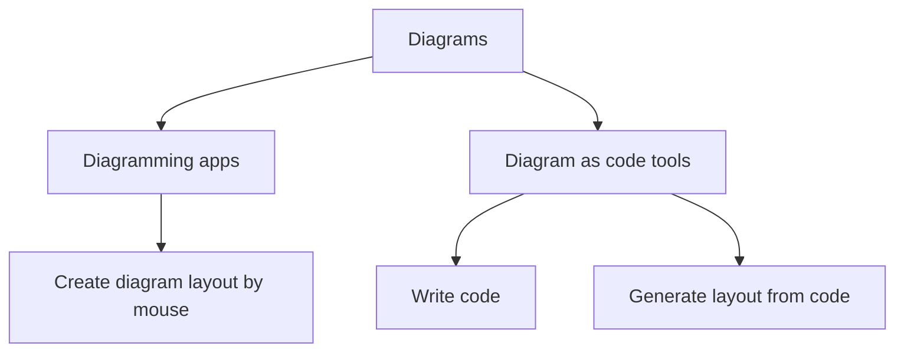
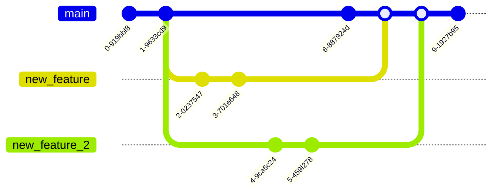

## Diagrams

Diagrams are a powerful tool for visualizing complex systems and processes.
They can help understand important information quickly and clearly.
However, creating diagrams can be time-consuming and tedious. You need to spend hours in diagramming app like lucidcharts or diagrams.net.
This is where diagrams as code come in.

## Diagrams as code

Diagrams as code, as the name suggests, involve writing code to generate diagram image or html automatically.
Most popular and mature tools for that is PlantUML and mermaid.

### Example

Let's generate simple visualisation with mermaid tool.

This is our code.
```
flowchart TD
    A[Diagrams]
    A --> B[Diagramming apps]
    B --> AB[Create diagram layout by mouse]
    A --> C[Diagram as code tools]
    C --> AC[Write code]
    C --> ABC[Generate layout from code]
```

And this is our visualization. 


## Benefits

Diagram as code has several benefits over traditional diagramming apps, including:

### Time saving

Major benefit of diagrams as code is that they can save time when editing existing diagrams.
Since diagrams are defined as code, changes can be made quickly and easily without the need to manually adjust the layout or formatting.

TODO example of relayout. Sequence 1, sequence 2 adds steps in the middle

### Automation

Diagrams code has simple structure allows for automation of the diagram creation process.
There is a variety of tools for generation diagrams from database structure, OpenAPI specification and code.
And it's simple to write script that fits your goal.

TODO Tool screenshot
TODO Add tool links

### Version control

You can get all benefits of using version control systems like Git. 
Changes can be tracked, reviewed and merged with conflicts solving.
Existing continuous integration tools can be used to analyse, check proper code style, enrich and generate documentation pages.



### Customization

Diagram as code tools has many existing themes and settings that can be used for style customization.

TODO different themes example

## Downsides

Some things may be not intuitive

### No UI

There is no component choosing menu and forms with all params.
So you need to know that you're looking to find it in documentation and examples.

### Frustrating layout correction

Automatically generated layout may not satisfy you. 
If that happens you need to use LAYOUT commands to correct generator.

## Learning

- Docs
- Docs
- Playground

## Usage

- Confluence plugin
- Hugo static site generator theme
- 99% chance of finding plugin or out of the box feature in your documentation tool

## Conclusion

With little learning time you will get ability to efficiently
- reuse existing diagrams to bootstrap new one
- visualise new features on existing diagrams
- get diagrams automatically from code or configuration

As a professional software developer, I prefer to use plantUML even in early design stages.
That's allows me to quickly iterate design by copying current draft and changing it.