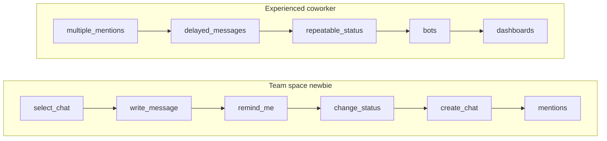
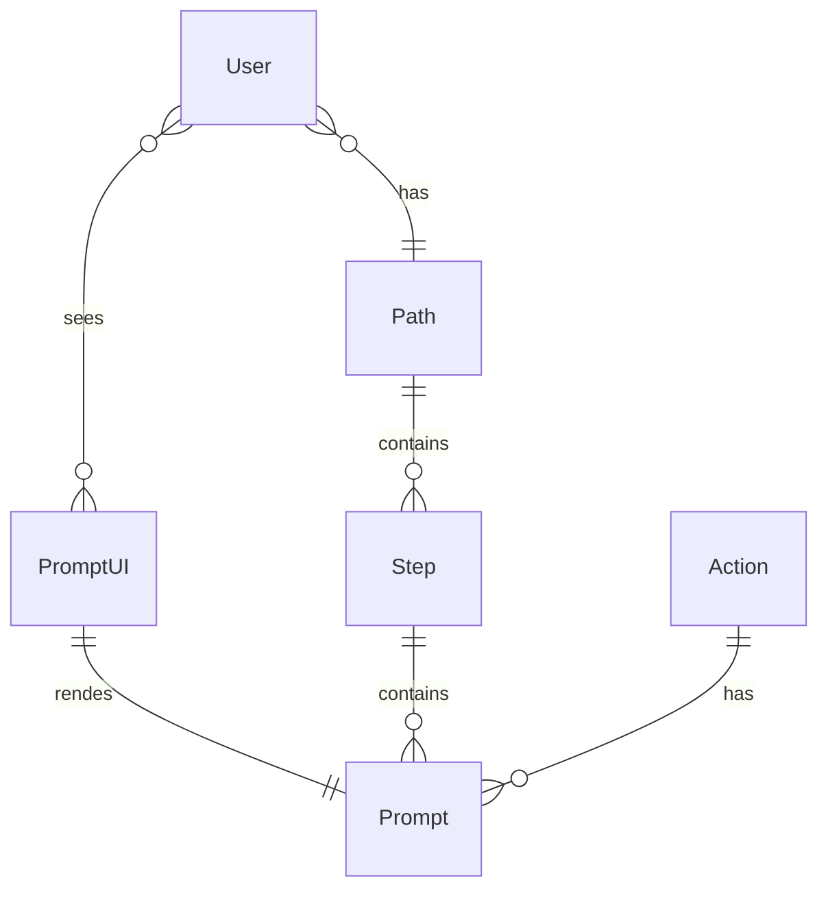
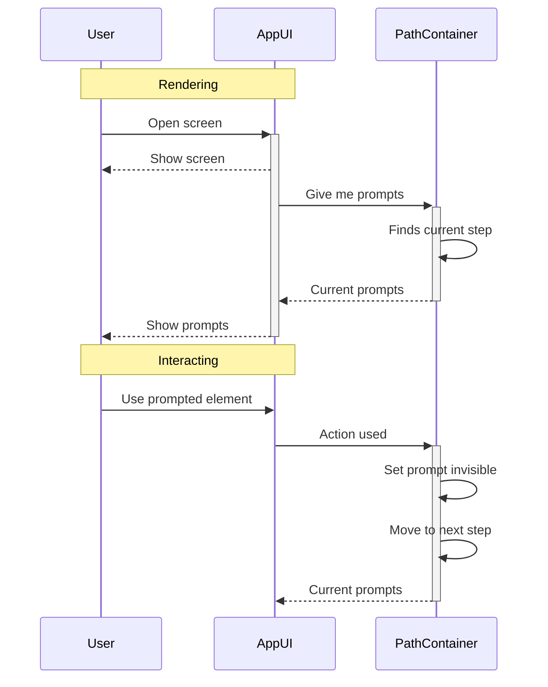
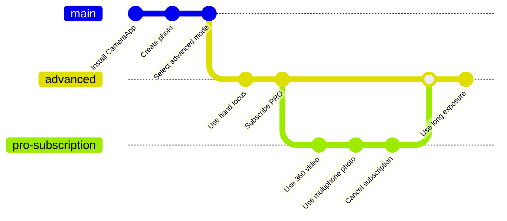
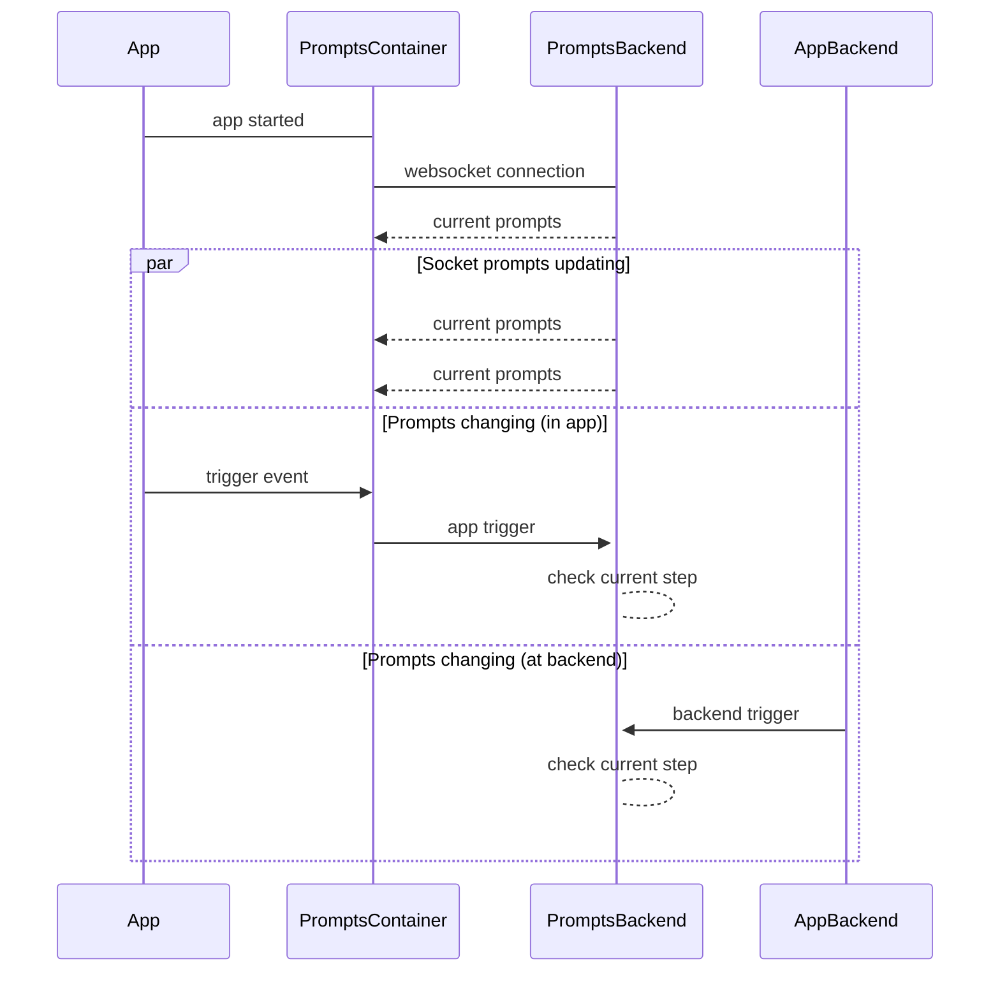
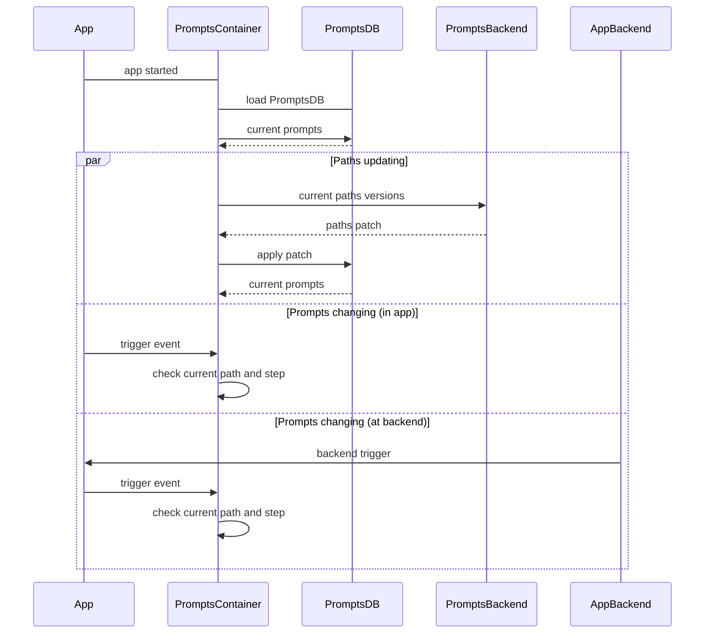
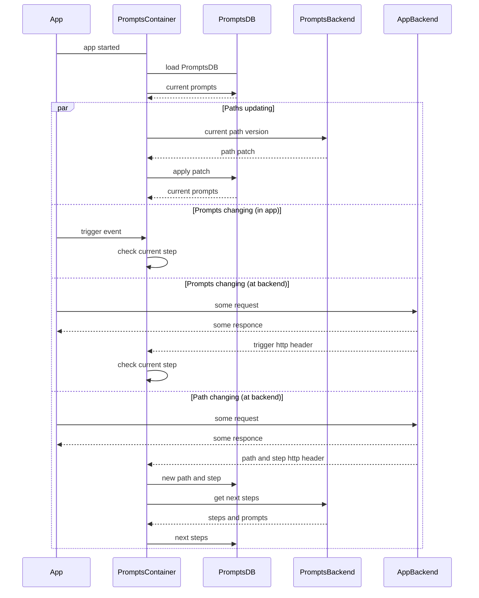

# Onboarding management system

Мы разработаем отдельный сервис позволяющий удаленно, без программирования управлять последовательностью и контентом
подсказок в приложении.

 

## Проблема

Нужно найти идеальный путь погружения пользователя в приложение и расставить подсказки. Чтобы он быстро увидел важную
ему ценность сервиса.

Путь может быть разным для пользователей с разным контекстом и запросом



### Ценность продукта

Чтобы найти идеальные пути, нужно много экспериментировать. Релизный цикл сильно растягивает получение обратной связи.

Поэтому мы разработаем no code on-boarding систему позволяющую:

1. Быстро менять последовательность шагов обучения пользователя;
2. Выделять сегменты пользователей с разными последовательностями;
3. Ставить эксперименты.

### Context

```architecture
Person(appUser, "App user", "Использует приложения для решения своих задач")
System_Ext(productApp, "Application", "Приложение продуктовой компании (B2C)")

Person(admin, "Admin", "Управляет конфигурацией приложения")
System(guideSystem, "Onboarding system", "Система управления обучением пользователя")

Rel(appUser, productApp, "Использует")
Rel(admin, guideSystem, "Использует")
Rel(admin, productApp, "Использует")
Rel_R(productApp, guideSystem, "Получает текущие подсказки")
```

#### Containers

Приложения интегрируются с системой посредством библиотек или API поверх HTTP.

```architecture
Person(appUser, "App user", "Пользователь приложения")

System_Boundary(productApp, "Application", "Приложение продуктовой компании") {
    Container_Ext(frontend_app, "Web App", "HTML, CSS, JS", "Браузерное приложение")
    Container_Ext(android_app, "Android App", "Kotlin", "Android приложение")
    Container_Ext(ios_app, "iOS App", "Swift", "iOS приложение")
    Container_Ext(backend, "App backend", "PHP/Python/Java/C#", "Серверная часть приложения")
}

Person(admin, "Admin", "Управляет конфигурацией приложения")
System(guideSystem, "Onboarding system", "Система управления обучением пользователя")

Lay_D(backend, guideSystem)

Rel(appUser, frontend_app, "Uses")
Rel(appUser, android_app, "Uses")
Rel(appUser, ios_app, "Uses")

Rel(frontend_app, backend, "Uses", "JSON, HTTP")
Rel(android_app, backend, "Uses", "JSON, HTTP")
Rel(ios_app, backend, "Uses", "JSON, HTTP")

Rel(frontend_app, guideSystem, "Uses", "JS lib")
Rel(android_app, guideSystem, "Uses", "Kotlin lib")
Rel(ios_app, guideSystem, "Uses", "Swift lib")
Rel_R(backend, guideSystem, "Uses", "JSON, HTTP")

Rel_R(admin, guideSystem, "Uses")
Rel_U(admin, backend, "Uses")
```

### Техническая ценность

Определим фокус при проектировании системы.

- Простота внедрения
- Отзывчивость
- Стоимость разработки и масштабирования

Простота внедрения. Как много усилий нужно сделать, чтобы добавить подсказки в своё приложение. Отзывчивость. Как быстро
после ключевого действия происходит обновление подсказок или сообщение.

## Функции сервиса

Соберем ключевые функции продукта и сценарии использования.


### Пользователь

1. Пользователю показываются
    - Красные точки
    - "New" badges
    - Bubbles
    - Затемнения с текстом и картинкой
    - Сообщения в центре уведомлений
2. Подсказка не видна после того как пользователь взаимодействовал с ней или со связанным с ней интерфейсом приложения
3. Пользователю показываются новые подсказки из следующего шага, когда будут пройдены самые важные подсказки этого шага
4. Шаги и подсказки выбираются в зависимости от группы пользователя

### Аналитик

1. Создает подсказки, объединяет их в шаги;
2. Собирает шаги в пути;
3. Создает группы пользователей, определяет какие пользователи в него попадают;
4. Запускает новую версию пути на всех пользователей или 50/50 через AB-тест.

### Сущности {id="entities"}



### Работа системы {id="sequence"}



### Смена пути

Пользователю может быть назначен новый путь обучения, если меняется его ключевое свойство, включая группу AB-теста.



Если был выполнен будущий шаг, теперь его нужно пропустить

### Итог

Мы собрали верхне уровневое представление о продукте. Теперь можем приступить к дизайну API.

## API design


Architecture - the decisions you wish you could get right early in a project.


В [этой диаграмме](#sequence) как PathContainer описана работа приложения с библиотекой.

Ключевая проблема системы - как доставлять подсказки в мобильное приложение. От этого существенно будет зависеть устройство бэкенда и команды разработки.

[TODO] Контейнер мобильного приложения. Wrapper ui элементов. Локальное хранилище.

### Дизайн не думая

Начнем с первого, что придет в голову. 

1. Приложение хранит только [подсказки](#entities) текущего шага. 
2. Хранилище подключается к бэкенду и получает текущий шаг и новые сообщения по сокету.
3. Бекенд принимает события о пройденных шагах от приложения по сокету, от основного бэкенда по API, шину сообщений, шину аналитики

[TODO] Диаграмма компонентов



Хорошо

- Простота внедрения для фронтенда (Wrapper ui элементов + синглтон = удобно)
- Цепочка обновляется сразу
- Нет логики на клиенте

Плохо

- Сокеты и постоянное соединение - дорогая инфраструктура
- Оффлайн не работает
- Cокеты не гарантируют мгновенной отзывчивости в смене подсказок

Итого. Этот дизайн не соответствует критериям отзывчивости и стоимости сопровождения. Пуши и поллинг дадут тот же эффект.

### Дизайн offline first

1. Есть запеченная цепочка, зашитая в сборку приложения.
2. Переключение на другой путь локально на клиенте.
3. Во время работы приложения пытаемся проверить актуальна ли версия цепочки. Загружаем
   обновления. Больше бэкенд не участвует. 
4. При совершении ключевых действий, нужно вызывать метод, уведомляющий хранилище.

[TODO] Диаграмма компонентов



Для реализации SDUI или вызова триггеров на стороне бэкенда нужно прокидывать ключ триггер на фронтенд.

Плюсы

- Отзывчивость и offline
- Простой и масштабируемый бэкенд

Минусы
- Нужно писать на бэкенде передачу триггера клиенту
- Цепочка обновляется спустя какое-то время или никогда (без интернета)
- Слишком умный клиент - часто будем сталкиваться, что без обновления библиотеки новые функции сервиса не внедрить. А ждать обновления костяка клиентов нужно долго.

Итог. Хорошо, но есть сложности с внедрением для пользователей и обновлениями для разработчиков.

### Делаем клиент глупее

1. Локально будем хранить только ровную цепочку шагов с минимальной логикой. На бэкенде принимать решение о смене пути. Мы все равно должны обращаться к серверу за обновлениями.
2. Библиотека будет обмениваться своими http заголовками с сервером. Устраним необходимость писать самим передачу ключей на клиент.

[TODO] Диаграмма компонентов



### Бекап ключей

Нужно ли отправлять пройденные ключи на бэкенд и запоминать их?

Плюсы
- Видим путь конкретного пользователя
- Можем синхронизировать ключи между устройствами и при переустановке приложения

Минусы
- Нужно больше места под БД
- Дополнительный высоко нагруженный запрос и обмен данными

Бизнес логики завязанной на пройденные ключи нет. Текущий путь зависит от свойств пользователя. От ключей зависит только шаг.
Потерять ключи при удалении приложения нестрашно. Потому что пользователя крайне сложно вернуть. А если вернется - он может пропустить часть обучения.

### Нужно ли хранить свойства пользователя

Нужно ли проверять, что свойства пользователя поменялись и путь нужно сменить?

### Итог

Итого. Мы проверяем обновление пути только при запуске приложения. Но бэкенд приложения может сменить путь сразу в ответ на ключевое действие.

Плохо, что нельзя мгновенно сменить путь оффлайн. Предполагаем, что необходимость мгновенной смены пути локально имеется у очень малого количества приложений. Будет спрос - доделаем.

## A/B тесты и аналитика эффективности

#### Что нужно для вывода

Чтобы понять, какой путь работает лучше, достаточно группировать события на клиенте по пути.
Мы дадим возможность получать текущий путь из хранилища на клиента и из заголовков запросов, чтобы прокидывать его в события.

| userId | timestamp | path_version | current_step | event |
|--------|-----------|--------------|--------------|-------|
| 123    | 2134      | 24           | 12           | buy   |
| 234    | 2345      | 24           | 13           | buy   |
| 345    | 3456      | 23           | 11           | buy   |

MLP - возможность провести тест новой версии пути разбив аудиторию пополам.
Будет простое рандомное распределение запросов пополам, присвоение им группы с новым путем или старым.

## System design

Теперь можно придумать бэкенд-архитектуру приложения.

### NFR

- Users 10^8
- DAU - 10^6
- max 1 path change per day per user
- ~100 steps per chain
- ~10 move next step for one user per day

### Где highload?

После устранения необходимости онлайн обмена сообщениями, осталась только одна проблема, которую можно назвать highload.

Это получение обновления или смены текущего пути пользователя.

Там происходит:
- Проверка АБ-теста
- Проверка актуальности версии текущего пути на клиенте
- Проверка изменения ключевых свойств пользователя и соответственно изменения пути
- Получение первой части пути, если его нужно обновить или заменить

Мы храним на бэкенде для аналитики пройденные триггеры всех пользователей.
Чтобы знать какой у пользователя сейчас путь и шаг и почему.
При изменении дерева, мы пересчитываем путь.

[TODO] Схема алгоритма проверок

Схема проверки текущего пути, версии и актуальности собранных ключей

```mermaid
flowchart TB
    
```

### Дизайн не думая

Схема с БД пользователей и путей, Сервис, система АБ тестов, интеграции для получения свойств пользователя.

Проблемы:
- Интеграции отдают результат медленно, нужно сделать процесс асинхронным
- Интеграции - содержат много разной логики, в том числе накопление информации. Нужно вынести в отдельные сервисы
- Пользователей существенно больше чем путей, там 100% нужно шардирование
- Единственная относительно нагруженная операция с путями - проверка актуальности версии пути

[WIP] Дальше draft

### Дизайн масштабирующейся системы

- Сервис путей с реляционной и транзакционной базой
- 

### Сервисы

- сервис путей
- сервис пользователей (АБ-тесты - обособленный модуль под вынос в будущем). Текущие пути, пользователи

## Team design

Цитата: Архитектура повторяет структуру коммуникаций

Потоки коммуникации и принятия технических решений:

- Обновление и добавление новых UI компонентов
- Обновление, оптимизация и масштабирование протокола получения и обновления пути и UI для его настройки
- Обновление, оптимизация и масштабирования определения групп пользователя и UI для их настройки
- Обновление и добавление новых источников данных


## Контекст

Для того чтобы архитектура системы и команды была реализуема, нужно учитывать контекст в котором будет создаваться
продукт.

- Средний аутсорс
- Фокус на
- Фокус на эксплуатации в облаке

## Roadmap

Flutter first
