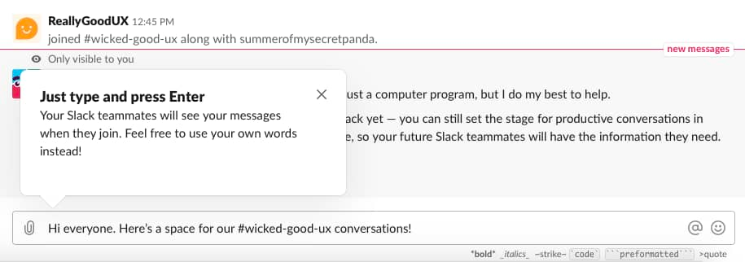
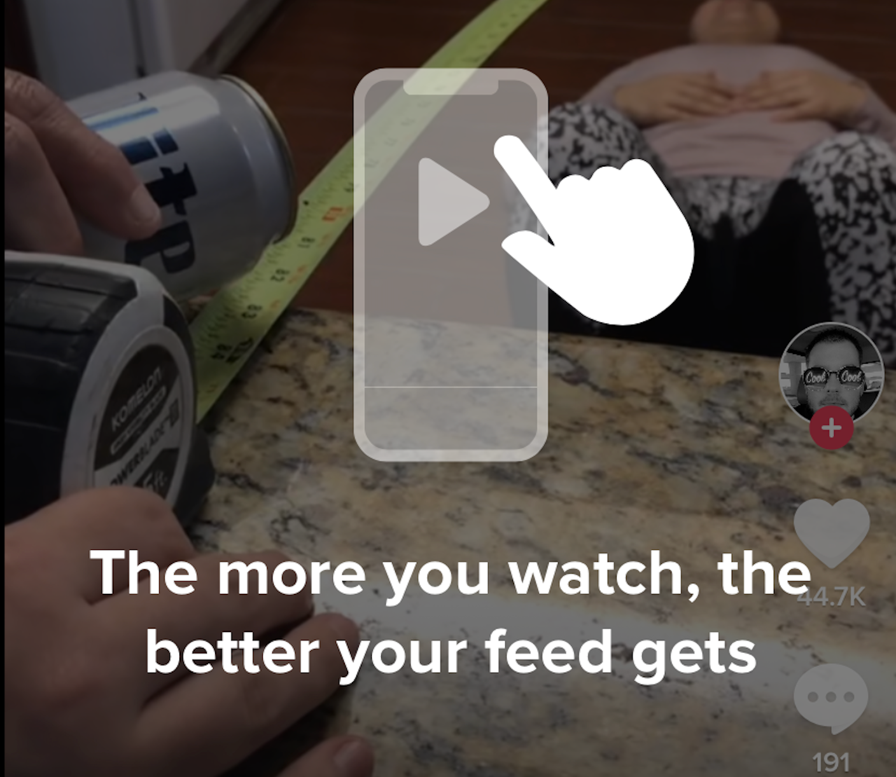
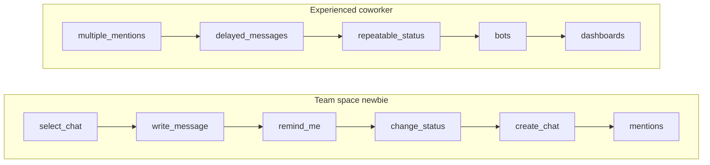
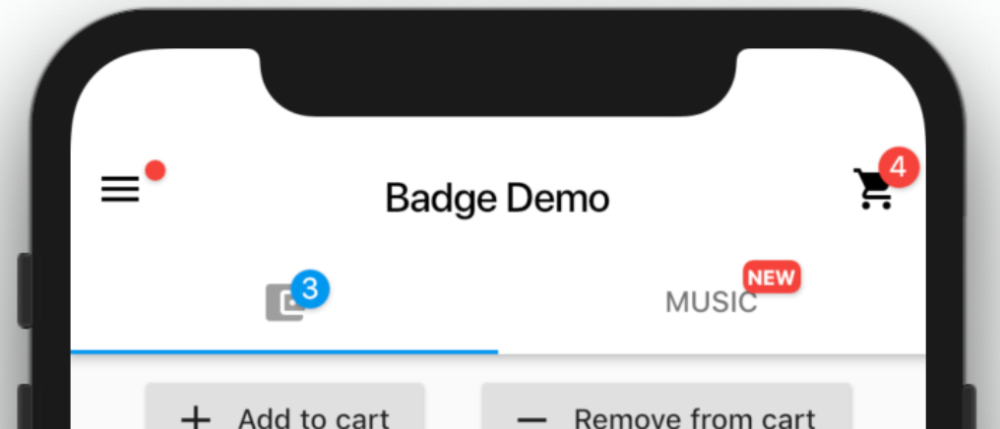
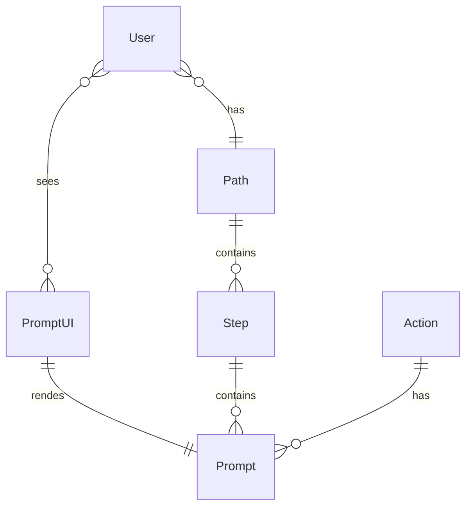
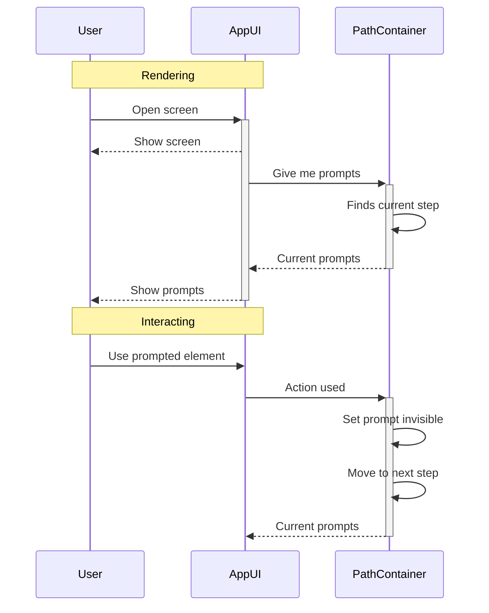
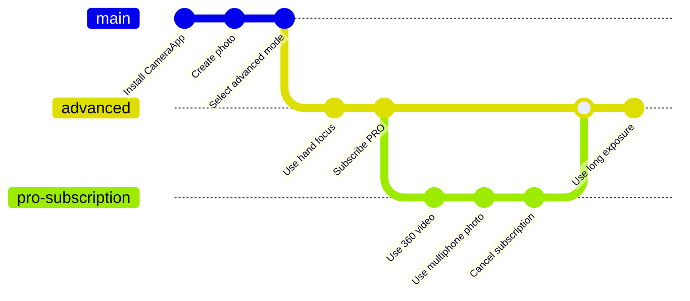

# Onboarding management system

Мы разработаем отдельный сервис позволяющий удаленно, без программирования управлять последовательностью и контентом подсказок в приложении.

 

## Проблема

Нужно найти идеальный путь погружения пользователя в приложение и расставить подсказки. Чтобы он быстро увидел важную ему ценность сервиса.

Путь может быть разным для пользователей с разным контекстом и запросом



### Инструмент

Чтобы найти идеальные пути, нужно много экспериментировать. Релизный цикл сильно растягивает получение обратной связи.

Поэтому мы разработаем no code on-boarding систему позволяющую:

1. Быстро менять последовательность шагов обучения пользователя;
2. Выделять сегменты пользователей с разными последовательностями;
3. Ставить эксперименты.

```architecture
HIDE_STEREOTYPE()

Person(appUser, "App user", "Пользователь приложения")
System_Ext(productApp, "Application", "Приложение продуктовой компании")

Person(guideManager, "Guide manager", "Пользователь системы")
System(guideSystem, "Guide system", "Система управления обучением")


Rel(appUser, productApp, "Использует")
Rel(guideManager, guideSystem, "Меняет настройки")
Rel(productApp, guideSystem, "Получает текущие подсказки")
```

## Функции сервиса



### Пользователь
1. Пользователю показываются 
   - Красные точки
   - "New" badges
   - Bubbles
   - Затемнения с текстом и картинкой
   - Сообщения в центре уведомлений
2. Подсказка не видна после того как пользователь взаимодействовал с ней или со связанным с ней интерфейсом приложения
3. Пользователю показываются новые подсказки из следующего шага, когда будут пройдены самые важные подсказки этого шага
4. Шаги и подсказки выбираются в зависимости от группы пользователя

### Аналитик
1. Создает подсказки, объединяет их в шаги;
2. Собирает шаги в пути;
3. Создает группы пользователей, определяет какие пользователи в него попадают.

### Сущности



### Работа системы



### Смена пути



Пользователю может быть назначен новый путь обучения, если меняется его ключевое свойство, включая группу AB-теста.

Если был выполнен будущий шаг, теперь его нужно пропустить

## Ценности

- Простота внедрения
- Отзывчивость
- Стоимость разработки и масштабирования

Простота внедрения. Как много усилий нужно сделать, чтобы довести подсказки до пользователей.
Отзывчивость. Как быстро после ключевого действия происходит обновление подсказок или сообщение.

## System design

[WIP] Дальше draft

### NFR

- Users 10^8
- DAU - 10^6
- 1 path change per day
- ~100 steps per chain
- ~10 move next step for one user per day

### Дизайн не думая

Пытаемся придумать максимально легко внедряемое решение.

1. Wrapper ui элементов. Локальное хранилище.
2. Хранилище подключается к бекенду и получает текущий шаг и обновления по сокету.
3. Бекенд принимает события от основного бекенда через метод или шину сообщений, шину аналитики

Хорошо
- Простота внедрения для фронтенда (Wrapper ui элементов + синглтон = удобно)
- Цепочка обновляется сразу

Плохо
- Сокеты - дорогая инфраструктура
- Оффлайн не работает, и вообще сокеты не гарантируют мгновенной отзывчивости

### Дизайн offline first

1. Wrapper ui элементов. Локальное хранилище.
2. Есть запеченная цепочка. Во время работы приложения пытаемся проверить актуальна ли версия цепочки. Загружаем обновления.
3. Больше бекенд не участвует. При совершении ключевых действий, нужно вызывать метод, уведомляющий хранилище.

Для реализации SDUI или вызова триггеров на стороне бекенда нужно прокидывать ключ триггер на фронтенд.

Хорошо
- Простота внедрения
- Отзывчивость и вообще оффлайн

Плохо
- Цепочка обновляется спустя какое-то время или никогда (без интернета)
- Слишком умный клиент - часто будем сталкиваться, что без обновления библиотеки новые функции сервиса не внедрить

### Пробуем обновлять цепочку сразу, но без сокетов

Храним ровную цепочку. На бекенде обрабатываем ветки

1. Почти сразу - пуши. Background process polling fallback (если не доступны google services)
2. Заголовки

## Development design

### Context

### Team design

### Roadmap

Flutter first
