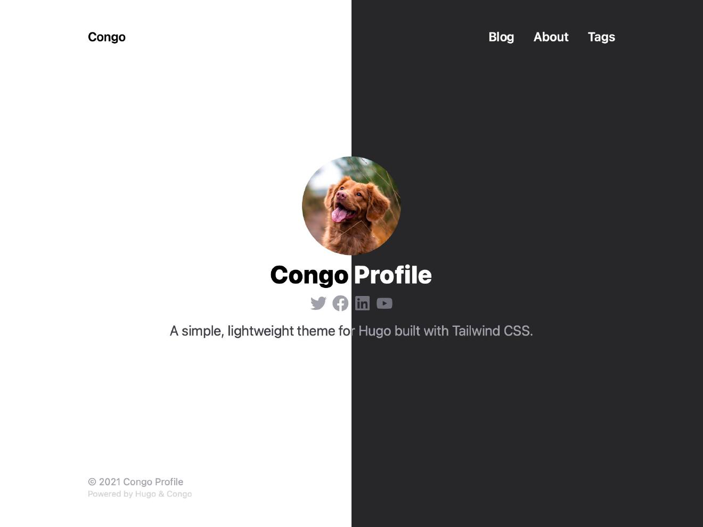
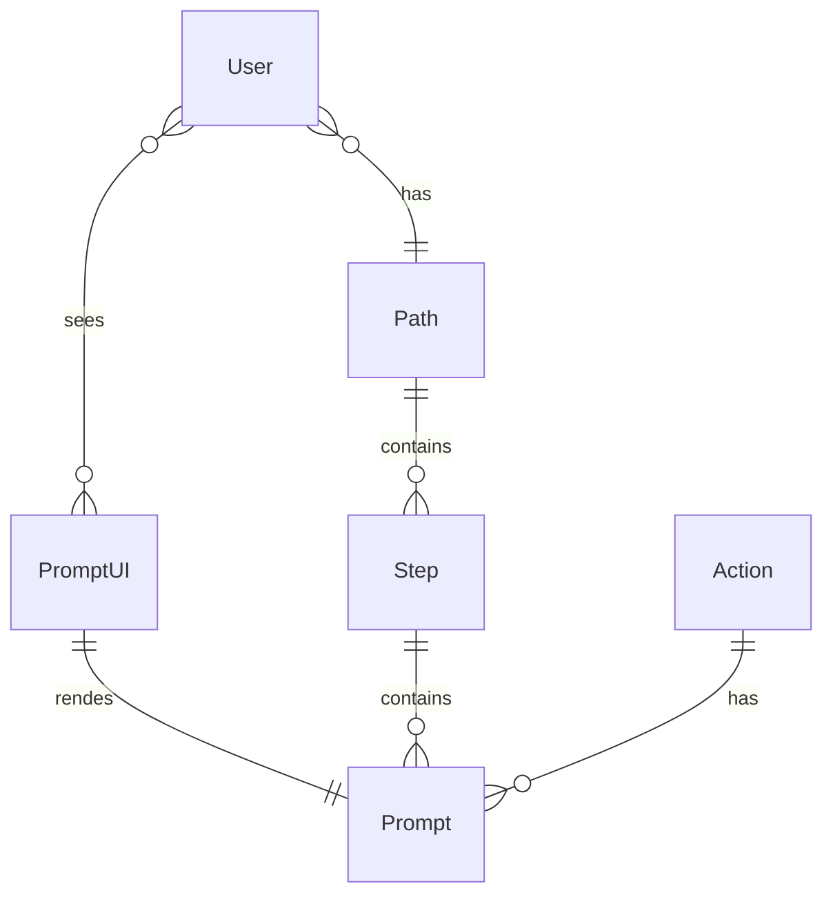
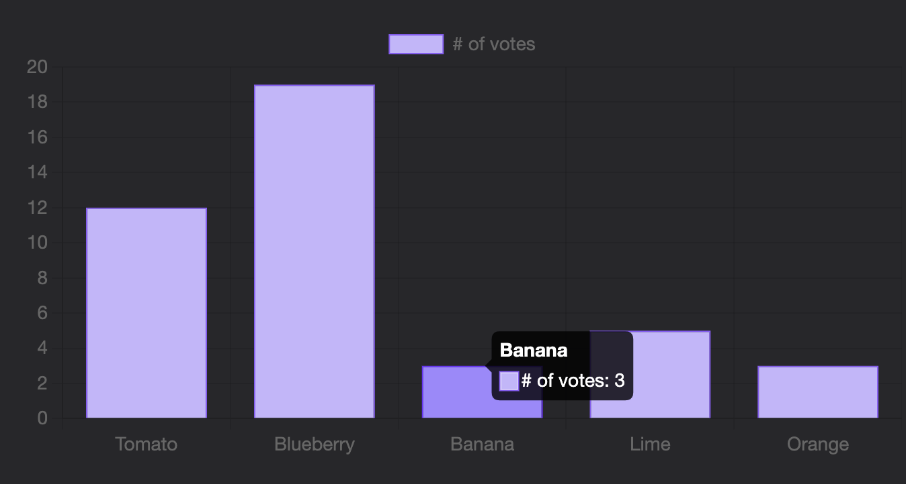
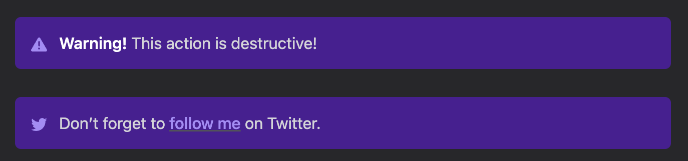

## Intro

A personal blog is a great way to develop skills, become part of an expert community, and advance your career.

Static site generators allow the creation of very feature-rich websites from Markdown files. 
[Hugo](https://gohugo.io/) has a huge and growing community of users because of its usage simplicity and generation speed. 

These two factors bring us a [lot of Hugo themes for blogs](https://themes.gohugo.io/tags/blog/).
It is easy to find a feature-rich theme but hard to find an elegant and stylish one.

Search no more, take [Congo](https://jpanther.github.io/congo/).  

This tool is ideal for creating both internal articles and personal blogs.

## Features

### Design and dark theme

Congo provides a clean and minimalist design in both dark and white themes.

### Profile/page homepage



A homepage is the root of your site and the place for the most important information.

Use a profile layout for a personal blog. Fill it with your skills and experience.
Use a page layout for a company blog. Fill it with useful links.

### Code

Code samples are a basic markdown feature supported for all Hugo themes.

```go
func gogo() {
	fmt.Println("code blocks")
}
```

### Congo shortcodes

Congo comes with plenty of useful shortcodes.
I want to highlight the most useful ones to help programmers, analysts, and QA share knowledge.

#### Mermaid

[Mermaid](https://mermaid.js.org/) is the best [diagram as code]() tool for all main diagram types and more.
You can easily generate entity diagrams and other diagram types
from project source code or SQL, or write them by yourself.



#### Charts

Illustrate your thoughts with [interactive charts](https://jpanther.github.io/congo/docs/shortcodes/#chart), generated from simple json.



You can automate schema and chart creation and actualization with basic programming skills. 

#### Alerts

You can make a strong accent on important details with alerts.



### Tailwind CSS

Congo was created with Tailwind CSS.
That allows you to customize color schemes and some elements without CSS knowledge easily.

Just follow [instructions](https://jpanther.github.io/congo/docs/advanced-customisation/#colour-schemes).

### Analytics

It is easy to add analytics for a personal blog.
Just by [adding file](https://jpanther.github.io/congo/docs/partials/#custom-analytics-providers) with one line of HTML.

I recommend free, privacy-focused [GoatCounter](https://www.goatcounter.com/). Just follow [instructions](https://www.goatcounter.com/help/start).

## Conclusion

As you can see, this theme has a beautiful design and tools for efficient knowledge sharing.
I recommend it as a starting point for a personal blog and an internal company portal.
