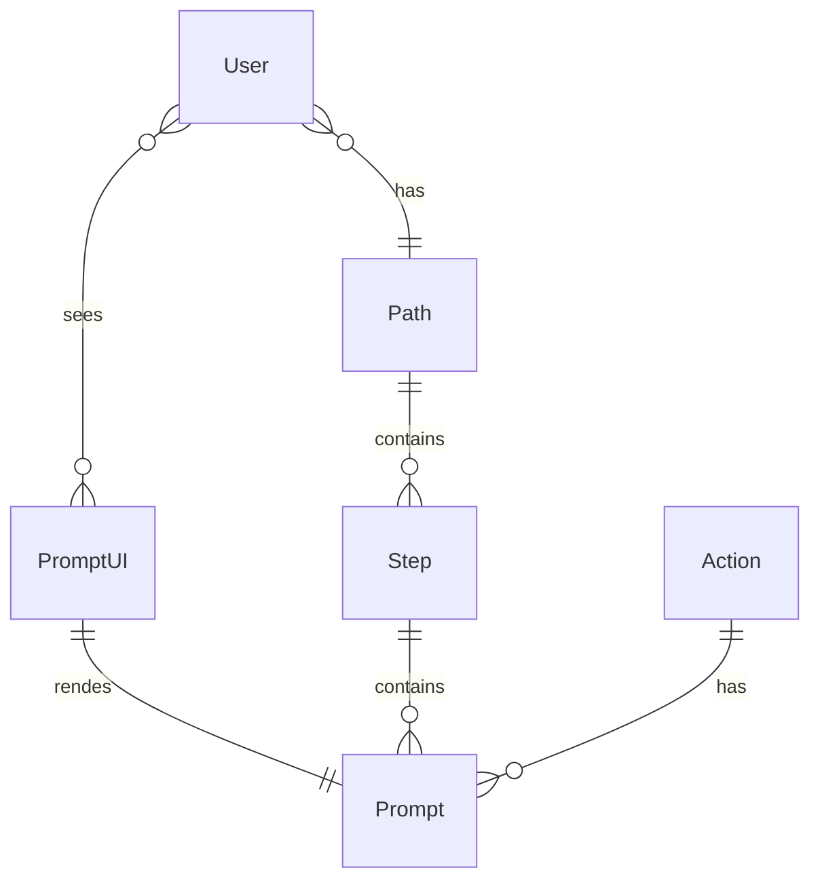

## Intro

A personal blog is a great way to develop skills, become part of an expert community, and advance your career.

Static site generators allows to create very feature rich websites just from markdown files.
[Hugo](https://gohugo.io/) has huge and growing community of users because of its usage simplicity and generation speed. 

This two factors brings us a [lot of hugo themes for blogs](https://themes.gohugo.io/tags/blog/).
But it's easy to find feature rich theme, but hard to find elegant and stylish. 

Search no more, take [Congo](https://jpanther.github.io/congo/).  

In my opinion, this tool is ideal for creating both internal articles and personal blog.

## Features

### Design and dark theme

Congo provides a clean and minimalist design in both dark and white theme.

### Profile/page homepage


Homepage is root of your site and place for most important information.

Use profile layout for your personal blog. Fill it with your skills and experience.
Use page layout for company blog. Fill it with useful links.

### Code

Code samples is basic markdown feature supported for all hugo themes.

```go
func gogo() {
	fmt.Println("code blocks")
}
```

### Congo shortcodes

Congo comes with a plenty of useful shortcodes.
I want to light best ones for sharing knowledge as programmer, analytic or QA.

#### Mermaid

[Mermaid](https://mermaid.js.org/) is the best [diagram as code]() tool for all main diagram types and more.
You can easily generate entity diagrams and other diagram types
from project source code or SQL, or write them yourself.



#### Charts

Illustrate your thoughts with [interactive charts](https://jpanther.github.io/congo/docs/shortcodes/#chart), generated from simple json.


With a basic programming skills you can automate schema and charts creation and actualization. 

#### Alerts

You can make strong accent on important details with alerts.


### Tailwind CSS

Congo created with Tailwind CSS.
That allows you to easily customize color scheme and some elements without CSS knowledge.

Just follow [instructions](https://jpanther.github.io/congo/docs/advanced-customisation/#colour-schemes).

### Analytics

That's easy to add analytics for your personal blog.
Just by [adding file](https://jpanther.github.io/congo/docs/partials/#custom-analytics-providers) with one line of html.

I'd like to recommend you free and privacy focused [GoatCounter](https://www.goatcounter.com/). Just follow [instructions](https://www.goatcounter.com/help/start).

## Conclusion

As you can see this theme has beautiful design and tools for efficient knowledge sharing.
I recommend it as a starting pont for personal blog and for internal company portal.