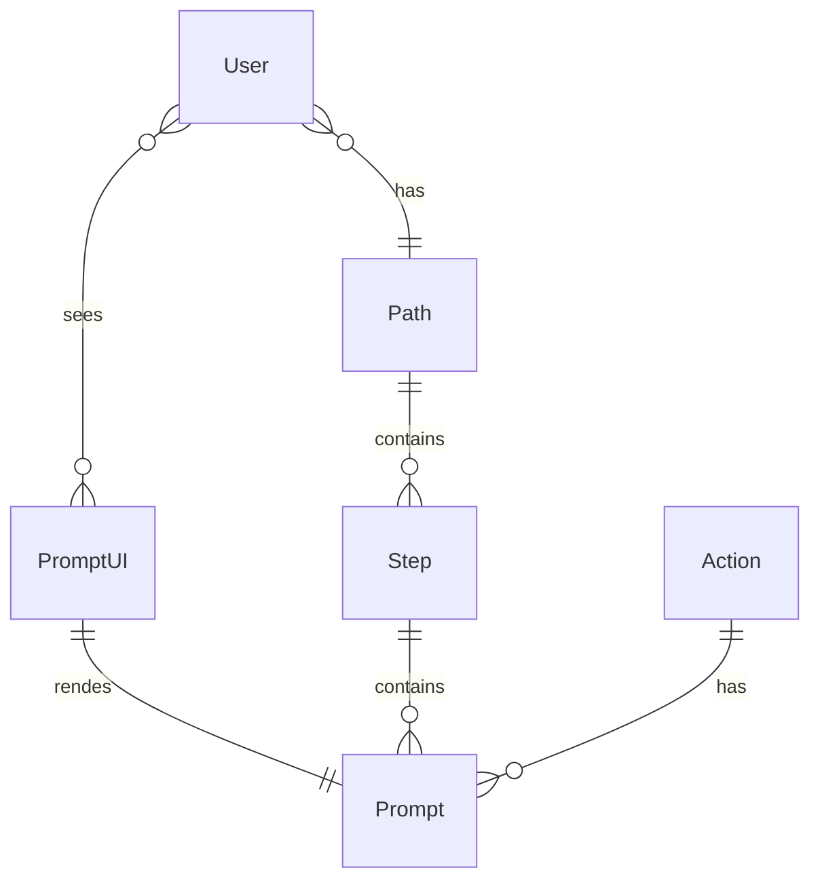
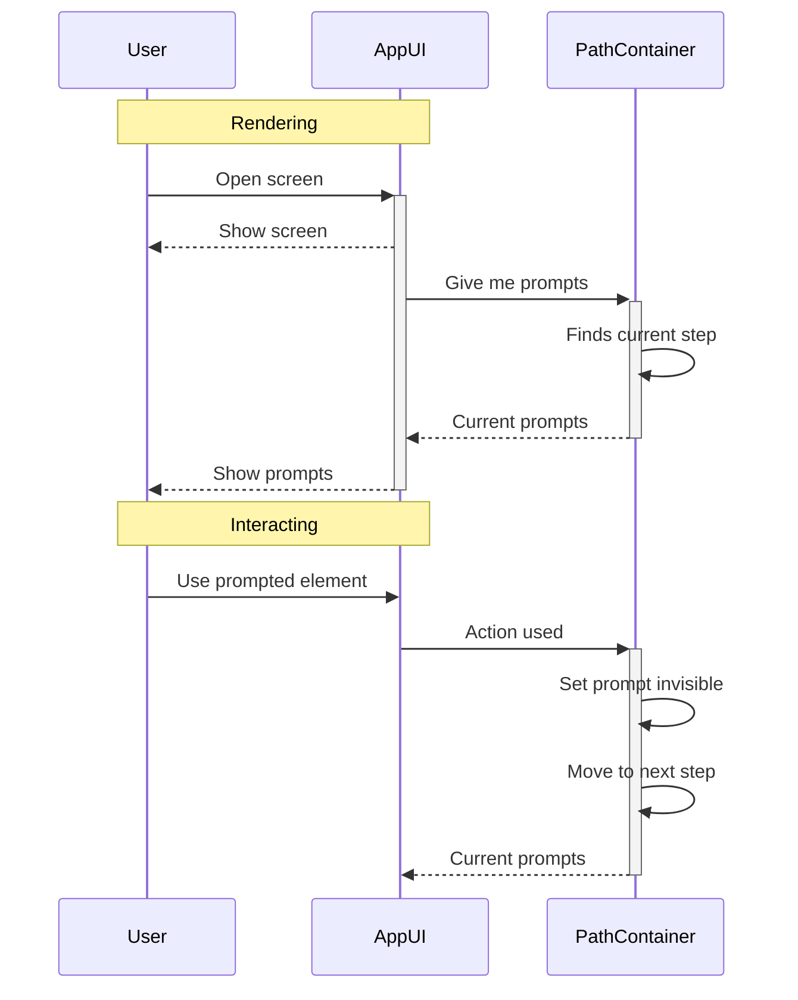
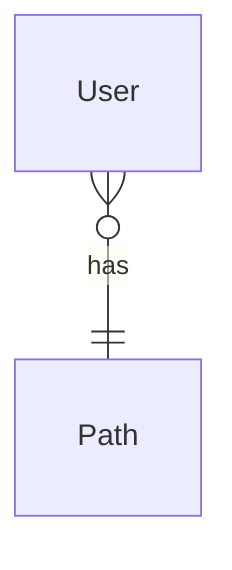
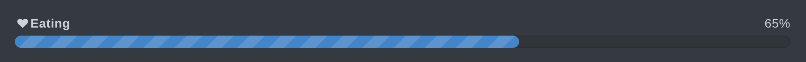

## Intro

Static site generators allow you to create feature-rich websites from just markdown files.
[Hugo](https://gohugo.io/) has a large and growing community of users due to its simplicity and speed of generation.

As a result, there are many useful [Hugo themes](https://themes.gohugo.io/tags/docs/) available for documentation sites,
and currently, [Geekdocs](https://geekdocs.de/) is the best one.

This tool is ideal for creating both internal articles and public documentation.

## Features

### Dark theme

That's it. It's a rare feature for many sites and tools.

### Tabs

It's an underestimated but handy feature for organizing content in a compact way.

You can easily show what's new, allowing users to quickly check old content and return to new.


 User can view and edit site pages

 User can view site pages  



You can provide a compact description of entities.


## User

Uses the site

## Admin

Changes content of the site

## Developer

Develops the site



You can compactly show different paths.


## Success

Good

## Auth error

Show "nono" message

## Internal error

Show "ops" message



### [Mermaid](https://mermaid.js.org/), diagrams as a code

The best [diagram as code]() tool for all main diagram types and more. 
You can easily generate entity diagrams and other diagram types 
from project source code or SQL, or write them yourself.


 ## Entity relation



You can use it inside tabs or other containers.

 ## Sequence
But sequenceDiagram has some little rendering troubles inside tabs :)






- git flow
- class diagram
- algorithm
  
  

### Columns

Since the main platform for documentation is the desktop, 
we can sacrifice mobile UX over compact and interactive content.

 <!-- begin columns block -->
**Values**

Show key values in a better way.

<---> <!-- magic separator, between columns -->

**Pros and cons**

Compare and list your arguments.



Show diagram and legend in two columns.


**Diagram**



<--->

**Definitions**

- User - uses the app.
- Path is a list of user-passed screens passed.



### Expand


## Expand

Hiding is not important under spoiler.


### Progress



### Hints


**Hits are powerful**

You can emphasize important details.


### Code

```go
func gogo() {
fmt.Println("code blocks")
}
```

## Conclusion

This theme has more useful features out of the box than Confluence. 
These features can improve communication efficiency compared to Google Docs, Confluence, and Miro. 

It can be used for pages about a product and its technical realization.

By using this theme, you can enjoy all the [benefits of static sites](). 
If you need guidance on using it comfortably and setting it up easily, feel free to contact me. 
I'll be happy to help you out.
