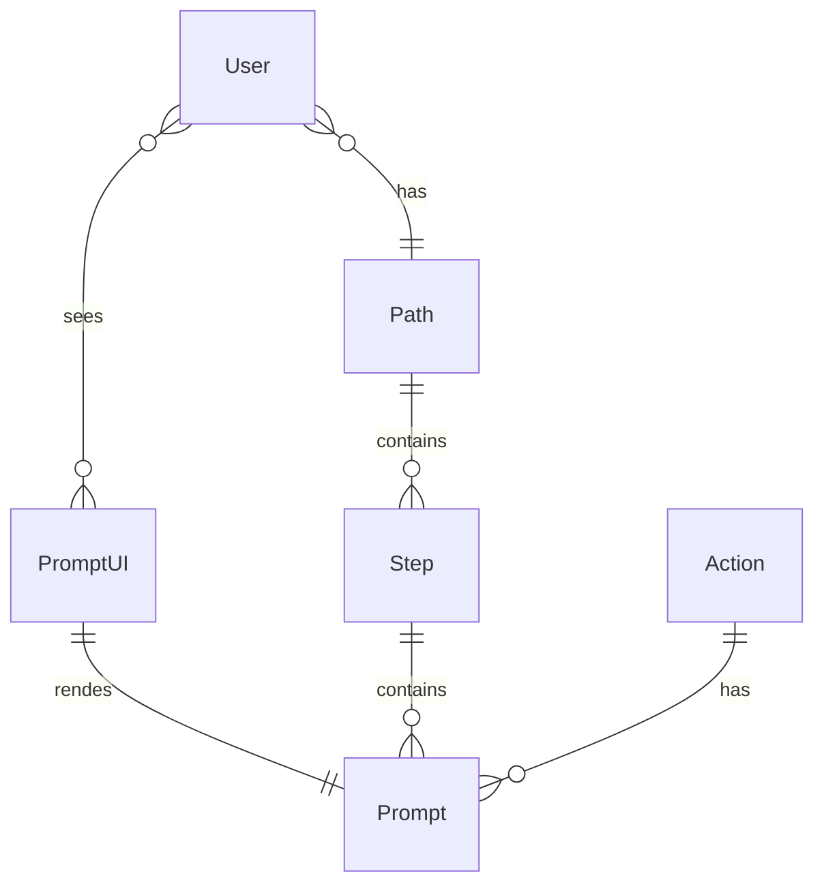
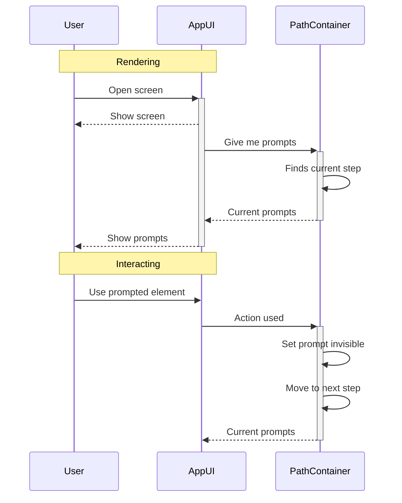
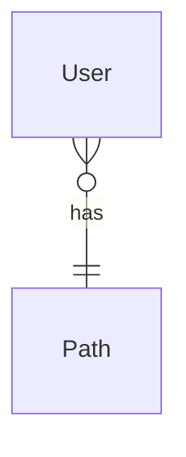
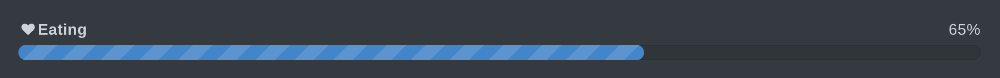

## Intro

Static site generators allows to create very feature rich websites just from markdown files.
[Hugo](https://gohugo.io/) has huge and growing community of users because of its usage simplicity and generation speed. 

This two factors brings us a [lot of useful hugo themes for documentation sites](https://themes.gohugo.io/tags/docs/). And [Geekdocs](https://geekdocs.de/) is best on that moment.  

In my opinion, this tool is ideal for creating both internal articles and public documentation.

## Features

### Dark theme

That's it. It's rare feature for many sites and tools.

### Tabs

Underestimated but very useful feature for content organizing in compact way.

You can show what's new. It allows quickly check old content and back to new.


 User can view and edit site pages 

 User can view site pages  




You can provide compact entity description.


 ## User
 
Uses the site 

 ## Admin

Changes content of the site 

 
# Developer 

Develops the site



You can compactly show different paths.


 ## Success
 
Good

 ## Auth error

Show "nono" message

 
# Internal error 

Show "ops" message



### Mermaid, diagrams as a code

Best diagram as a code tool. All main diagram types and more. You can easily get or write by yourself entity diagram generation and other diagram types from project source code or sql.


 ## Entity relation



You can use it inside tabs or other containers.

 ## Sequence
But sequenceDiagram has some little rendering troubles inside tabs :)




- git flow
- class diagram
- algorithm



### Columns

Documentation main platform is desktop. So we can sacrifice mobile UX for compact and interactive content.

 <!-- begin columns block -->
**Values**

Show key values in better way.

<---> <!-- magic separator, between columns -->

**Pros and cons**

Compare and list your arguments.



Show diagram and tabs in two columns. Allow to interact with diagram

TODO check shortcode inside shortcode


**Diagram**



<--->

**Definitions**

- User - uses the app.
- Path is a list of user passed screens passed.



### Includes

Another underestimated feature. You can paste common content and page previews by one line.

TODO code and screenshot

### Expand


## Expand
Hiding not important under spoiler.


### Progress

Express work progress or some achievements



### Hints


**Hits is powerful**

You can make strong accent on important details.


### Code

```go
func gogo() {
	fmt.Println("code blocks")
}
```

## Conclusion

Out of the box this theme has more useful features than confluence. That features can improve communication efficiency in comparison with google docs, confluence and miro. It can be used for pages about product and its technical realization. If you need advice about comfortable usage and easy setup, go look at other articles here.