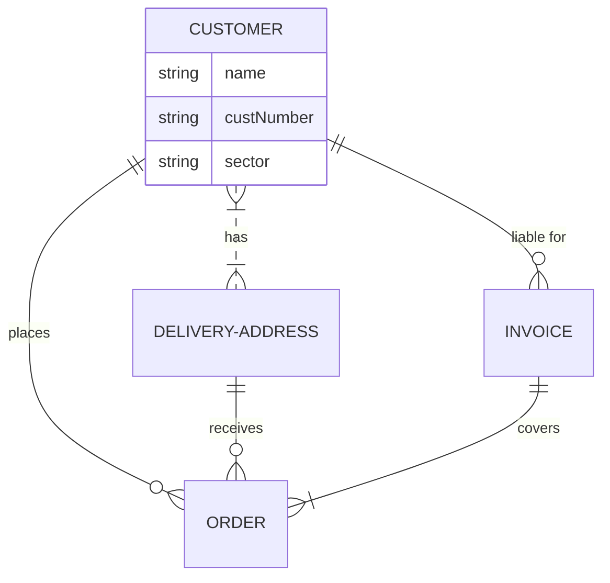
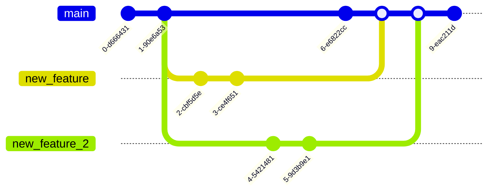
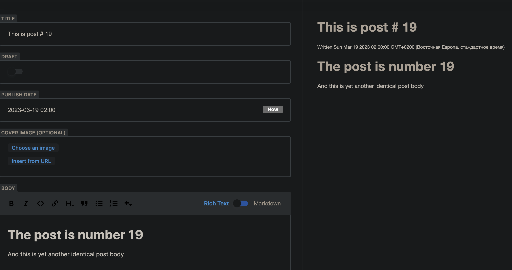
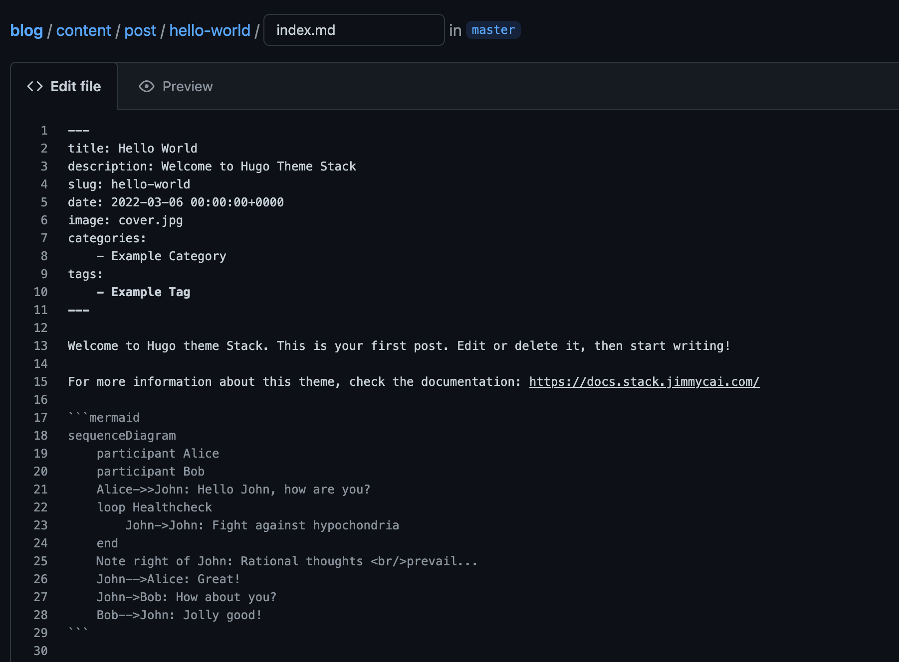
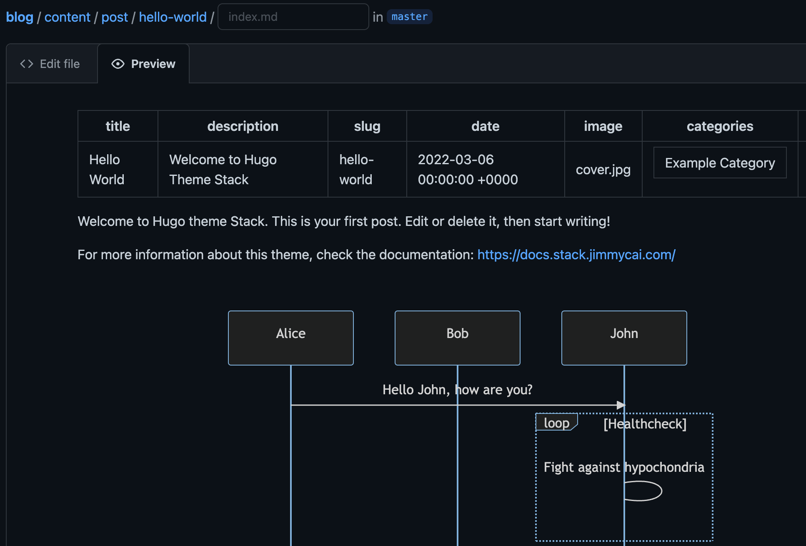
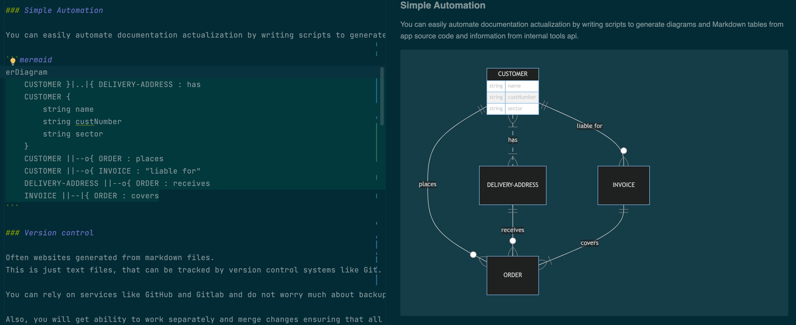

When it comes to creating documentation, there are many apps available. Some of them are Confluence, Google Docs, and Miro.
They have different UI but can be used for transferring knowledge purpose.

However, there is an old and still popular way of creating documentation using static site generators.
In this article, we'll explore why static site generators can be a better choice for documentation than complex apps.

## Benefits

Let's start with pros.

### Better Speed

Quick page loading is one of the most significant advantages of using a static site generator for documentation.
It's one of the most valuable parts of the reader experience.

Static sites are pre-generated and don't rely on a server to generate content on the fly.
On another side, dynamic apps can do many sub-requests to Backend API or database during page loading.

Also, already generated files allow skipping page loading using HTTP caching mechanisms such as the If-Modified-Since header.
This makes the site even quicker without complex caching infrastructure.

### Simple Automation

You can easily automate documentation actualization by writing scripts to generate diagrams and Markdown tables from app source code and information from internal tools API.

### Version control

Often websites are generated from Markdown files.
These are just text files that can be tracked by version control systems like Git.

You can rely on services like GitHub and GitLab and do not worry much about backups because all can be quickly repaired from sources.

Also, you can work separately and merge changes, ensuring that all the latest work is saved. 

### High Customization

Static site generators have a variety of open-source themes to choose from, and each of them has customization settings. 
That's why it's easy to apply your company's UI style and extend a site with tools you are interested in.

For example, this site theme. It doesn't have diagrams and tabs out of the box, but adding it with no CSS knowledge was easy.

### No license fees

Many popular static site generators, such as Jekyll, Hugo, and Gatsby, are open-source and can be used without licensing fees.
You pay only for your site's web server.
On the other side, Confluence, Gitbook, and Miro have expensive tariffs that charge depending on the members' count.

## Downsides

There are several cons.

### Infrastructure required

Running your own static site is much cheaper than SaaS documentation.
However, it requires development time, web server, and maintenance.

Many static site generators offer easy deployment options, 
and many third-party services like Netlify, Versel, Gitlab, and GitHub Pages 
can help simplify this process.

Also, you can use cloud services such as S3 (or Object Storage) almost for free without programming.

[//]: # (TODO See my guide to creating documentation with team members' access control.)

[//]: # (TODO create an article about minimal setup. Basic auth, uploading through S3 UI &#40;mini io + caddy / S3 + basic auth&#41;)
[//]: # (TODO add guide link)

### No WYSIWYG editor out of the box

WYSIWYG (What You See is What You Get) is an editor UI where you can review how the website page will look.

But generators don't have this out of the box.
The main goal of static site generators is creating website files from text files such as Markdown.

If you need a web editor interface, you need to choose and integrate it.
There is CMS specialized in editing Markdown files content in git repositories.
For example, [tinaCMS](https://tina.io/) or [DecapCMS](https://decapcms.org/).

By the way, I don't recommend you to do this. There is a better alternative.

#### Common users

Users needing markdown functions such as headers, tables, 
or diagrams can easily use the integrated editor in GitLab or GitHub, 
which includes a preview feature.
As you can see, the preview also supports diagrams.

#### Advanced users

Users who need to edit templates can benefit from popular IDEs that have plugins capable of visualizing Markdown and diagrams.
This approach is more productive due to the rich project navigation and text editor functions available.

### No likes, subscription, and comments

Common. Does anybody use it? Is some process rely on it? Not, mostly.

Any important change requires a real-time presentation speech or at least a mail or messaging announcement.
Or it will be 100% missed. 

## Conclusion

Integration of a static site generator in your knowledge management process has a few struggles.
You need to create your own infrastructure and educate editors on using it.

But they offer you the best reader experience, customization, automation, and low costs at any scale.

I want to recommend this solution to any organization.

- For small developer teams, it allows using the same tools and processes for code and documentation files at zero cost.
- For huge companies, it easily integrates quality control and automation, improves reader experience, and significantly lowers costs.
