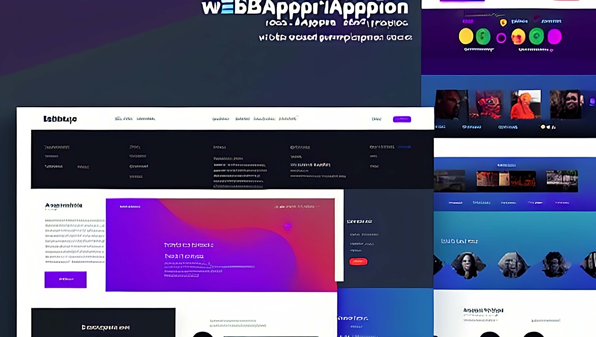

When it comes to creating documentation, there are many apps available. Ones of them is Confluence, Google Docs, and Miro.
Its has different UI but can be used for transferring knowledge purpose.

However, there is an old and still popular way of creating documentation using static site generators.
In this article, we'll explore why static site generators can be better choice for documentation than complex apps.

## Benefits

Let's start from pros.

### Better Speed



<--->
One of the biggest advantages of using a static site generator for documentation is quick pages loading.
It's one of the most valuable parts of reader experience.


Static sites are pre-generated and don't rely on a server to generate content on the fly.
On other side dynamic apps can do many sub-requests to Backend API or database during page loading.

Also having already generated files allows to skip page loading by using HTTP cashing mechanism such Modified Since header.
That makes site even quicker without complex caching infrastructure.

### Simple Automation

You can easily automate documentation actualization by writing scripts to generate diagrams and Markdown tables from app source code and information from internal tools api.

### Version control

Often websites generated from markdown files.
This is just text files, that can be tracked by version control systems like Git.

You can rely on services like GitHub and Gitlab and do not worry much about backups, because all can be quickly repaired from sources.

Also, you will get ability to work separately and merge changes ensuring that all latest work saved. 

### High Customization

Static sites generators have a variety of open source themes for choosing and each of them has customization settings. 
That's why it's easy to apply your company's UI style and extend a site with tools you are interested in.

For example this site theme. It hasn't diagrams and tabs out of the box, but it was easy to add it with no css knowledge.

### No licence fees

Many popular static site generators like Jekyll, Hugo, and Gatsby are open-source and can be used without any licensing fees.
You are paying only for your sites web server.
Confluence, gitbook, miro on other side has expensive tariffs that charges depending on members count.

## Downsides

There is some cons.

### Infrastructure required

Running your own static site much cheaper than SaaS documentation.
But it requires development time, web server and maintenance.

However, many static site generators offer easy deployment options, 
and there are also many third-party services like Netlify, Versel, Gitlab and GitHub Pages that can help simplify this process.

Also, you can use cloud services such as S3 (or Object Storage) almost for free without programming.
See my guide of creating documentation with team members access control.

[//]: # (TODO create an article about minimal setup. Basic auth, uploading through S3 UI &#40;mini io + caddy / S3 + basic auth&#41;)
[//]: # (TODO add guide link)

### No WYSIWYG editor out of the box

WYSIWYG (What You See is What You Get) is editor UI when you can review how website page will look.

But generators has not this out of the box. 
Static sites generators main goal is creating website files from text files such as markdown.

If you need web editor interface. You need to chose and integrate it.
There is CMS specialized in editing markdown files content if git repositories.
For example [tinaCMS](https://tina.io/) or [DecapCMS](https://decapcms.org/).

By the way, I don't recommend you to do this. There is better alternative, in my opinion. 

For users that need only markdown functions like headers, tables or even diagrams.
It easy to use Gitlab or GitHub integrated editor that has preview.

For advanced users. Popular IDE already has plugins able to visualize markdown and diagrams.
This is enough, and even more productive because of rich project navigation and text editor functions.

### No likes, subscription and comments

Common. Does anybody use them? Is some process rely on it? Not, mostly.

Any important change requires real time presentation speech or at least mail or messaging announcement.
Or it will be 100% missed. 

## Conclusion

Integration of static sites generator in your knowledge management process has few struggle (затратных, фрустрирующих, непонятных) moments.
You need to create your own infrastructure and educate editors how to use it.

But they offer you best reader experience, customization, automation and low budget (низкие затраты) at any scale.

I'd like to recommend this solution for any organization.

- For a small developer teams it allows to use same tools and process for code and documentation files at zero cost.
- For huge companies it allows easily integrate quality control and automation, improve reader experience, and significantly lower costs.
